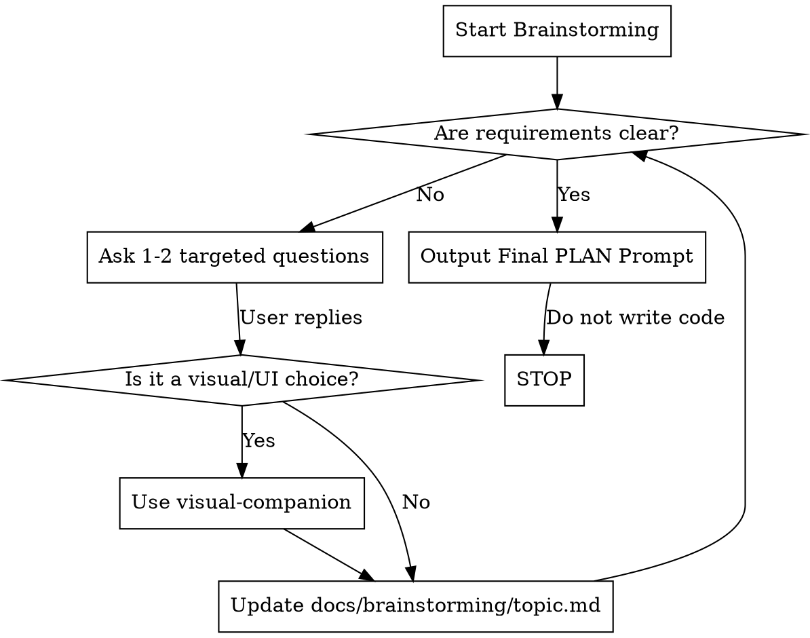

# Brainstorming Features

## Overview
This skill defines the strict process for transforming a user's raw idea into a fully-rounded prompt (Task Contract) ready for the `AGENTS.md` PLAN stage.

## When to Use

- User says "I need to brainstorm this idea"
- User provides a vague feature request without a formal Task Contract
- User asks for help turning a concept into a development plan

**When NOT to use:**
- User provides a complete Task Contract
- User is asking you to execute an already approved PLAN
- User is asking for code generation

## The Fundamental Rule

**You are here to produce a PROMPT, not a PLAN.**
When using this skill, your ultimate and ONLY goal is to output a fully formatted Task Contract prompt for the *next* agent session. 

**Violating the letter of the rules is violating the spirit of the rules.**

## Red Flags - STOP and Start Over

- Writing implementation code.
- Writing the `implementation_plan.md` or a technical plan.
- Making architectural decisions without asking the user.
- Fleshing out "fake" requirements without user input.
- "I'll just outline the files to change to save time."
- "I already have enough info, I'll write the plan."

**All of these mean: Stop. Delete your output. Start over and generate the Prompt.**

## Decision Flow



## Core Workflow

### 1. Evaluate the Request
Does the user's initial request contain all fields required for a Task Contract? (Context, Outcomes, History, Constraints).
If not, you must ask clarifying questions.

### 2. Iterative Questioning
Ask 1-2 questions at a time. Do not overwhelm the user with a giant questionnaire.
If the feature involves UI/layout changes, strictly use the `visual-companion` tool (`docs/brainstorming/visual-companion.md`) to show options rather than just asking text questions.

### 3. Document Rationale
As decisions are made, document the rationale and discussion in a separate file: `docs/brainstorming/<topic>.md`. 
This keeps the final prompt clean while preserving the "why" for the Historical Context.

### 4. Generate the Final Prompt
Once all aspects are clear, output the final prompt for the user. Do nothing else.
The prompt MUST follow this exact format:

```markdown
Task name: [Clear, specific objective]
Context: [What is the current state? What needs to change? Affected systems]
Desired outcome: [Acceptance criteria, definition of done]
Historical context: [Related prior tasks or refer to docs/brainstorming/<topic>.md]
Constraints (do/don't): [Arch rules, do's and don'ts, e.g., "Do not use fake data"]
Instructions: This is the PLAN process. Create a plan that addresses the user's specific request. Do not write code until the user has approved your plan.
```

## Common Rationalizations (DO NOT FALL FOR THESE)

| Excuse | Reality |
|--------|---------|
| "I'll just write the plan now to save time." | Violates the AGENTS.md state machine. You are generating the prompt *for* the PLAN stage. |
| "I'll create the files and scaffold the code." | Banned. No code is written during brainstorming. |
| "The user's prompt is detailed enough, I don't need to ask questions." | Verify every Required Field of the Task Contract is explicitly covered. If not, ask. |
| "I'll dump 10 questions at once." | Users hate this. Ask 1-2 critical questions, get answers, then adapt. |
