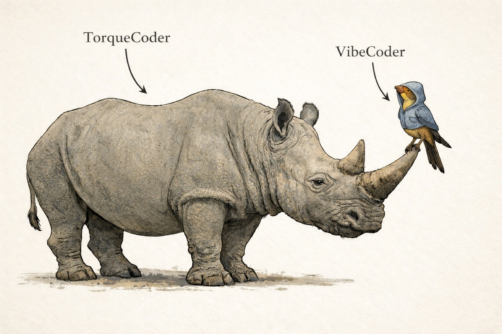

# Torque Coding

<p align="center">
  
</p>

**Bridge vibe speed with engineering repeatability — one approval gate at a time.**

A jack of all trades is a master of none, but oftentimes better than a master of one.

AI agents are capable of everything. Paradoxically, this is a hindrance.

Engineering tasks rarely call on a single domain. Reliability collapses when an agent is asked to operate as multiple personas across a multi-faceted task.

In isolation, agents behave like experts.
In combination, that clarity breaks down.

Which persona owns the task?
The database designer, the API engineer, or the system architect?

Torque coding is an attempt to preserve that expert isolation across complex work.

The capability does not change.
The application of it does.

Torque coding constrains how capability is applied through skills, memory, constraints, and survivability, rather than attempting to redefine the agent itself.

It bridges the gap between the speed of vibe coding and the predictable, repeatable nature of traditional engineering.

- **Version**: aligned with `agent/AGENTS.md` 2.4
- **Status**: public template repo + NPX installer

---

## Quick Start

```bash
npx torque-coding
```

This runs an interactive installer that:

1. Asks what you're building (Web, Mobile, Backend, or none)
2. Asks which optional skills to include
3. Installs the operating model into `.agent/`
4. Scaffolds an empty `.memory-bank/`
5. Writes `.torque-coding.json` so future `npx torque-coding update`
   runs can refresh managed files without touching `.memory-bank/`

Then open an AI session and run:

```
"Read docs/memory-bank/bootstrap-memory-bank-contract.md and execute it."
```

This scans your actual code to populate the memory bank. Commit `AGENTS.md`, `.agent/`, `docs/memory-bank/`, `.memory-bank/`, and `.torque-coding.json` when done.

### Install from GitHub directly

```bash
npx github:jackson2787/torque-coding
```

---

## What Gets Installed

```
AGENTS.md                                    ← The operating model (state machine)

.agent/
└── skills/
    ├── state-machine/                     ← Core workflow skills
    │   ├── writing-plans/                 ← PLAN state
    │   ├── build-execution/               ← BUILD state
    │   ├── systematic-debugging/          ← QA debugging
    │   └── verification-before-completion/← QA verification
    └── memory-bank/                       ← Per-document update skills
        ├── update-architecture/
        ├── update-active-context/
        ├── update-decisions/
        ├── update-task-docs/
        ├── update-project-brief/
        ├── update-product-context/
        ├── update-toc/
        └── mb-rebase/                     ← Human-in-the-loop doc calibration

docs/memory-bank/
├── bootstrap-memory-bank-contract.md      ← One-time memory bank setup
└── templates/                             ← Document templates

.memory-bank/
├── architecture.md                        ← Tech stack, patterns, rules
├── activeContext.md                        ← Current state, progress, session data
├── projectBrief.md                        ← Project identity and scope
├── productContext.md                       ← Users and product context
├── decisions.md                           ← Architectural decision records
├── toc.md                                 ← File index
└── tasks/YYYY-MM/                         ← Monthly task history
```

`.torque-coding.json` lives at the project root as the hidden install manifest
for `npx torque-coding update`. If it is missing on an older install, `update`
will infer the installed skills from `.agent/skills/` and rewrite the manifest
at the new root location. If inference also fails, rerun `npx torque-coding init`.
`update` compares managed-file checksums before overwriting; if it sees local
edits, it warns and asks before proceeding.

The Memory Bank is intentionally hidden under `.memory-bank/`. Treat that as
the canonical path rather than looking for a visible `memory-bank/` folder.

---

## The State Machine

```
EXPLORE → PLAN → BUILD → DIFF → QA → APPROVAL → APPLY → DOCS → EXPLORE
```

| State | What happens |
|-------|-------------|
| **EXPLORE** | Read-only investigation. Default entry state. |
| **PLAN** | Design the approach. Cites `file:line`, maps reuse. |
| **BUILD** | Write the code. Implements plan, writes tests. |
| **DIFF** | Present changes with rationale. |
| **QA** | Run tests, lint, verify. |
| **APPROVAL** | Human gate. Say "approved" or request changes. |
| **APPLY** | Apply to branch. |
| **DOCS** | Update memory bank via per-document skills. |

See [docs/agent-zero-cheat-sheet.md](./docs/agent-zero-cheat-sheet.md) for the full user reference.

---

## Skill Packs

Skill packs add domain-specific behavioural disciplines that get injected into the PLAN and BUILD states. The installer handles selection and merging.

| Pack | Designed For | Skills Included |
|------|-------------|-----------------|
| **Web** | React / Next.js | react-best-practices, next-best-practices, next-cache-components, next-upgrade, accessible-ui, api-feature-request, composition-patterns |
| **Mobile** | React Native / Expo | react-native-skills, expo-native-data-fetching, accessible-ui, api-feature-request, composition-patterns |
| **Backend** | Supabase / Hono | backend-architect-supabase-hono, supabase-postgres-best-practices |

Skill packs are stored in `skill-packs/` and organised by domain:

- `skill-packs/frontend-web-skills/`
- `skill-packs/frontend-mobile-skills/`
- `skill-packs/frontend-shared-skills/` (shared across Web and Mobile)
- `skill-packs/backend-skills/`

Each pack includes `plan.injected-skills.md` and `build.injected-skills.md` files that the installer merges into the writing-plans and build-execution skill references.

---

## Optional Skills

These are standalone skills selected during installation:

| Skill | What It Does |
|-------|-------------|
| **idea-to-task** | Turns vague ideas into structured task contracts for the PLAN state. Trigger with `Create task contract`; emits `Ideas to Task Contract running...` when used. |
| **best-practices-audit** | Produces a structured audit against installed playbook and skill packs |
| **legal-compliance-checker** | Adds legal/regulatory review framing for privacy, payments, health data |

### Turning Ideas Into Tasks

If you have a rough human-language idea, ask the agent:

```text
Create task contract: [your brainstorming idea]
```

For example:

```text
Create task contract: I want a safer way to refresh installed skills without touching memory bank files.
```

This tells the `idea-to-task` skill to shape the idea into a task contract for the PLAN state.

### sync-api (agent-assisted install)

The `sync-api` skill requires project-level setup beyond a simple file copy — scripts in your project root, Orval config, npm dependencies. When selected during `npx torque-coding`, it gets staged to `docs/memory-bank/skills-to-install/sync-api/` instead of installed directly.

To complete installation, ask your agent:

```
"Read docs/memory-bank/skills-to-install/sync-api/installation.md and execute it."
```

The agent copies the files, installs dependencies, and cleans up the staging directory.

---

## Memory Bank

The memory bank is the agent's persistent context across sessions. It survives compaction and session restarts.

| File | Purpose | Update Skill |
|------|---------|-------------|
| `projectBrief.md` | Project identity, mission, scope | `update-project-brief` |
| `productContext.md` | Users, jobs to be done, flows | `update-product-context` |
| `architecture.md` | Tech stack, patterns, rules | `update-architecture` |
| `activeContext.md` | Current state, progress, session data | `update-active-context` |
| `decisions.md` | Architectural decision records | `update-decisions` |
| `toc.md` | File index | `update-toc` |

Each file has a dedicated update skill that enforces its constitutional structure. The agent uses these skills automatically during the DOCS state.

To calibrate a document with human knowledge, use the `mb-rebase` skill:

```
"mb-rebase architecture.md"
```

---

## The Operating Model

The operating model comes from `agent/AGENTS.md`, aligned to the [AGENT-ZERO](https://github.com/msitarzewski/AGENT-ZERO) approach.

Key principles:

- **Reuse over creation** — extend before you create
- **Approval gates** — no changes applied without explicit human approval
- **Architecture-first** — plans cite current code and existing patterns
- **Memory bank discipline** — persist high-signal context for repeatable sessions
- **Compaction safety** — state survives context compression via activeContext.md

---

## Sources & Lineage

This repository is an original synthesis informed by ideas and patterns from excellent open-source projects. Credit is due to the teams whose work shaped the thinking here.

- [AGENT-ZERO](https://github.com/msitarzewski/AGENT-ZERO) — core operating-model inspiration for the state machine, approval gates, and memory bank discipline
- [agency-agents](https://github.com/msitarzewski/agency-agents) — broader thinking around agent workflows and reusable agent behaviours
- [Obra Superpowers](https://github.com/obra/superpowers) — skill-oriented composition model and the idea that agents benefit from explicit operating constraints
- [Vercel / Next.js](https://github.com/vercel/next.js) — frontend and React/Next.js guidance
- [Expo](https://github.com/expo/expo) — mobile and React Native guidance
- [Supabase](https://github.com/supabase/supabase) — backend and Postgres-first architecture guidance

This project is not an official implementation of, fork of, or endorsed derivative of any of the repositories above. Where ideas overlap, the intent is attribution, adaptation, and extension.

---

## License

[MIT](./LICENSE)
